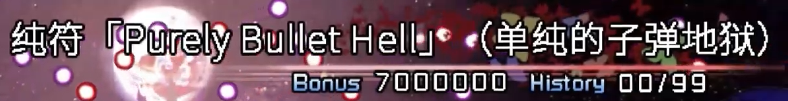
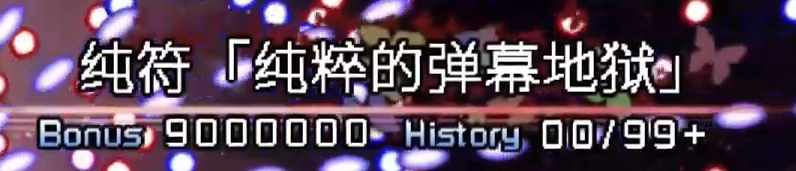

> 注：此文章为[B站同文章](https://www.bilibili.com/opus/1206682967506681856)的镜像

实际上就是这两次音MAD的创作历程（  
说得很乱，还请见谅。

## 东方杏坛铭 2nd 的音 MAD 合作（2025.11.2）

> [合作本体](https://www.bilibili.com/video/BV18f15BuEku)

去年 9.10，有个音 MADer 加入了北邮的东方群，把群里另外两个潜水音 MADer 炸出来了（我们三都是 25 届小登）。然后我们发现你邮没有音 MAD 交流群，于是就地组建了“北邮音 MAD 小群”，也就是之后北京高校音 MAD 交流群的前身。  
建群 3 天后，也就是 9.12，第二届东方杏坛铭主催提议，我们几个音 MADer 可以给例会做个音 MAD 合作。  

（届时，北大的东方例会“东方幻想指南”已经在25年上半年整了一次音 MAD 合作）

因为找了好几个组曲都比较长/没 midi，而整个制作团队只有5人，例会又是定在 11.2 举办，我们几个决定搞个自由组曲合作。  
填表，定曲，然后`y的自然对数`把组曲草案做了出来（大致用AI组合了一下原曲），我就负责去找 midi 和音源，拼好组曲（啥）。  
反正，在国庆假期刚结束时，整个组曲赶完了。

然后就是毫无波澜实则很赶的音 MAD 本体制作，此时 ddl 还剩下不到一个月。

简单提一下我这段：

首先选心之所在是因为前不久我刚做完[这个作品](https://www.bilibili.com/video/BV162aozFEog)。  
组曲做好没几天后，我刚把 N 难度纯符收了（冷知识：当时设定的P点是3.99），于是就想用这段素材做心之所在段的背景。  
但这完全达不到我想要的效果，或者说根本不能用。还能怎么办？手动还原弹幕呗。

但有一个大问题：
我不会 Lua，更不会用 LuaSTG。

以及：
我也不会用 After Effects 和 Premiere Pro 做动画。

> 此处插入广告（动起来，动起来）

好在之前还用过一点 Scratch，于是我打算用 Turbowarp（Scratch 3.0 的 fork）还原弹幕，然后用 thtk 把 th15.dat 拆拆包拼符卡素材。

纯道中背景之前有大佬制作了 4K 16:9 版本，直接借用就是了。

还原符卡时有个小巧思：当时我收的是 N 难度「ピュアリーバレットヘル」，但「純粋な弾幕地獄」是 H / L 难度符卡，显然我打不动。但既然换成手动还原弹幕了，那还用说啥。于是就有了弹幕段中间的 N 难度一转 L 难度。

Bonus 分数也跟着变了，以及 00 / 99 也改成了 00 / 99+（如图）。

  

音频部分的话，前面混了一点熙攘市场今何在都听出来了吧（背景也有剪影）。  
以及，心之所在段的开头部分，在组曲草案里`y的自然对数`是拿《東方言えるかな》接上去的。

在熬夜*做完我那段后：我怎么成总混音了？原来还有第二关。  
*：指某天赶 PV，早 7 点睡，早 ⑨ 点醒。

反正总工程（PV + 音频）一直到例会前不到一周才渲染完成。  
也是辛苦各位（包括我）赶工了。  
（是谁在最后一刻才渲染音频总轨的）

## 第一届东方清源录的音 MAD 合作（2026.5.16）

> [合作本体](https://www.bilibili.com/video/BV1hCL56PEDJ)

赶啊，很赶啊。  
一周 + 一天速通组曲 midi + 段落制作 + 辅助修改 + 总混音这块。

> 实际上`y的自然对数`在 4.29 就把组曲的 REAPER 工程文件发到合作群了，但我这拖延症晚期患者到 5.5 才动工修改。

5.9 改完组曲，5.11 赶完音频，5.13 赶完 PV，5.14 赶完辅助修改 + 总混音。  
只能说还好这段时间是军训，要不然我一上课拖延症就会变成拖延症++，然后导致合作坠毁。

原本打算致敬一下[这个作品](https://www.bilibili.com/video/BV1yA411k7vq)的，但我之前完全没用过 UTAU / OpenUTAU 做人力，只能套 midi + 白开水调音了。  
（为什么音源是 唄音ウタ 和 重音テト，我没别的能用的音源了）

PV 字幕这块，只能紧急学习一下 [zzzzz9125 的教程](https://www.bilibili.com/opus/727320074309861409)应急，默认的字幕插件不认一堆自定义字体。  
何意味这玩意还是旧版功能，得手动开的。

以及这次道中背景不是原本对应的 5 面，这里用 6 面背景效果更好点。

至于为什么选 Crazy Back Dancers + トランスダンスアナーキー 的组合作为本段使用曲，最近我感到有些无力和混乱（物理和精神层面的），感觉整个人的状态跟这曲子比较契合（啥），就挑了这首。

反正整个人是在一个比较混乱的状态下赶完了这部分。

硬要说的话就是下面三种状态的叠加态（网易云上《トランスダンスアナーキー》的评论区，取自热评及楼中楼）：

  
  

本来想说如果我精神残疾了，就在轮椅上绑火箭的。但现在这轮椅要不然就是翻车，要不然就是燃料不够了。

拉拉杂杂写了这么多，就这样罢。